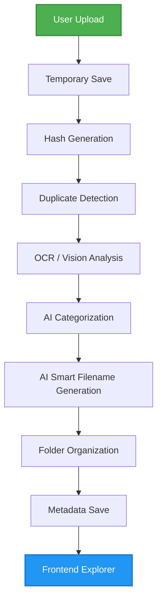
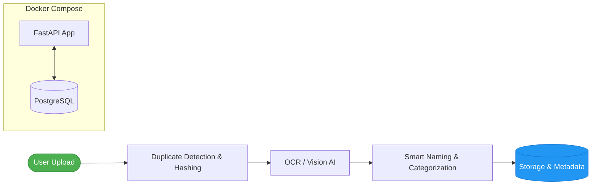

<div align="center">

# 🚀 AI File Intelligence System

> An advanced AI-powered intelligent file management platform built using **FastAPI**, **Groq AI**, **OCR pipelines**, **Vision AI**, **metadata indexing**, and **duplicate detection systems**.

### 🧠 An intelligent file manager that doesn't just store files — it understands them.

</div>

---

## 🛠️ Tech Stack


---

# 🌟 The Vision

Traditional file systems only store files.

This project attempts to mimic **human-level reasoning** while handling files.

Instead of blindly storing uploads, the system:

- Understands uploaded content
- Detects duplicate documents/images
- Categorizes files intelligently
- Renames files semantically
- Organizes storage automatically
- Tracks metadata and analytics
- Allows intelligent browsing and retrieval

The goal was to create something closer to:

- Google Drive AI
- Intelligent enterprise document systems
- AI-powered storage platforms
- Smart file organization engines

instead of another beginner CRUD project pretending to be revolutionary because the button has rounded corners.

---

# 🧠 Core Features

## ✅ Multimodal File Processing

Supports:

- Images
- PDFs
- Text files
- CSV files
- JSON files
- Code files
- Audio files
- Video files
- Office documents

---

## ✅ AI Vision + OCR Pipeline

Uses Groq Vision Models to:

- Extract text from images
- Understand documents visually
- Analyze IDs
- Detect file meaning
- Generate summaries

### Example

```text
IMG_2025.png
↓
Indian_Elector_ID_Card.png
```

---

## ✅ Intelligent Duplicate Detection

The system does **NOT** rely on filenames.

Instead, it uses multiple detection layers:

### 1. SHA256 File Hashing
Detects exact duplicate files.

### 2. Perceptual Image Hashing (pHash)
Detects visually similar images.

### 3. Content Hashing
Detects semantically identical documents.

This allows:
- screenshot duplicate detection
- renamed duplicate detection
- visually similar file detection

while avoiding false positives caused by filenames.

---

## ✅ Smart AI Naming

AI generates meaningful filenames based on file content.

### Example

```text
resume_final_latest.pdf
↓
Python_Developer_Resume.pdf
```

### Naming Logic

- 95% content-based
- 5% original filename hint

### Fallback Names

- Government_ID
- Resume
- Finance_Document
- Education_File

---

## ✅ Automatic Categorization

Files are automatically sorted into categories using:
- OCR
- AI understanding
- keyword classification
- content analysis

### Example Folder Structure

```text
uploads/
├── Government_Documents/
├── Finance/
├── Education/
├── Resume/
├── Media_Image/
├── Media_Video/
└── General/
```

---

## ✅ Metadata System

Every upload generates structured metadata.

### Example Metadata

```json
{
  "original_filename": "IMG_001.png",
  "new_filename": "Indian_Elector_ID_Card.png",
  "category": "Government_Documents",
  "file_hash": "...",
  "image_hash": "...",
  "uploaded_at": "2026-05-15T12:00:00Z"
}
```

Metadata powers:
- analytics
- search
- duplicate detection
- explorer system
- audit tracking

---

## ✅ File Explorer

Users can:
- browse categories
- inspect uploaded files
- open documents
- view metadata
- interact with organized storage

The project behaves more like:

```text
mini AI-powered cloud storage platform
```

than a basic upload API.

---

## ✅ Analytics API

The `/stats` endpoint provides:

- total files
- category counts
- file-type analytics
- usage insights

### Example

```json
{
  "total_files": 24,
  "categories": {
    "Government_Documents": 8,
    "Education": 6
  },
  "file_types": {
    ".png": 10,
    ".pdf": 5
  }
}
```

---

## ✅ Frontend Dashboard

Built using:
- HTML
- CSS
- Jinja2 Templates

Features:
- Upload interface
- Metadata viewer
- File explorer
- Analytics access
- Dark modern UI

---

# 🏗️ Project Architecture



---

# ⚙️ Technology Stack

| Layer | Technologies |
|---|---|
| Backend | FastAPI, Python, Uvicorn |
| AI / LLM | Groq API, Llama Models, Vision Models |
| OCR / Processing | PyMuPDF, pytesseract, Pillow, imagehash |
| Frontend | HTML, CSS, Jinja2 Templates |
| Data Storage | JSON Metadata Store |
| Deployment | Docker, GitHub |

---

# 📁 Folder Structure

```text
AI File Intelligence System/
│
├── app/
│   ├── routes/
│   │   └── upload.py
│   │
│   ├── services/
│   │   ├── file_processor.py
│   │   ├── gemini_service.py
│   │   └── metadata_manager.py
│   │
│   ├── utils/
│   │   └── logger.py
│   │
│   ├── config/
│   │   └── settings.py
│   │
│   └── main.py
│
├── frontend/
│   ├── templates/
│   │   └── index.html
│   │
│   └── static/
│       └── css/
│           └── style.css
│
├── uploads/
├── metadata/
│   └── files.json
│
├── Dockerfile
├── requirements.txt
├── Procfile
├── runtime.txt
└── README.md
```

---

# 🔌 API Endpoints

| Method | Endpoint | Description |
|---|---|---|
| POST | `/upload` | Upload and process files |
| GET | `/stats` | File analytics |
| GET | `/explorer` | Browse categories |
| GET | `/file/{category}/{filename}` | Open file |
| GET | `/metadata/files.json` | View metadata |

---

# 🐳 Docker Deployment

The project is being containerized using Docker.

Planned architecture:



Docker volumes will persist:
- uploads
- metadata
- future databases

This avoids:
```text
works on my machine
```

which is basically the oldest curse in software engineering.

---

# 🚧 Challenges Faced

## Duplicate Detection Problems

Initial logic incorrectly used:

```text
filename = duplicate
```

which caused false positives.

Fixed using:
- SHA256 hashing
- perceptual image hashing
- content hashing

---

## OCR & Vision Problems

Some image documents produced weak extraction.

Solutions:
- improved prompts
- fallback naming logic
- MIME validation
- retry systems
- deterministic naming

---

## Circular Import Errors

Service-layer dependencies caused circular imports.

Fixed through:
- architecture separation
- modular service design

---

# 📚 Learning Outcomes

This project teaches:

- Backend architecture
- FastAPI development
- AI orchestration
- OCR pipelines
- Vision AI integration
- Metadata systems
- Duplicate detection logic
- Frontend integration
- Docker concepts
- Deployment workflows
- Real-world engineering patterns

---

# 🚀 Future Improvements

## Planned Features

### 🔍 Semantic Search

Search naturally:

```text
show my government IDs
```

using embeddings/vector databases.

---

### 🐘 PostgreSQL Integration

Move from JSON storage to scalable database architecture.

---

### 👤 Authentication System

- user accounts
- login/signup
- role-based access

---

### ☁️ Cloud Storage

Integrate:
- AWS S3
- Cloudinary
- Google Cloud Storage

---

### 💬 AI Chat with Files

Ask questions directly about uploaded documents.

Example:

```text
Summarize this PDF
```

---

### 🎯 Drag & Drop Frontend

Modern frontend interactions and dashboard improvements.

---

# 💡 Why This Project Matters

This project goes beyond beginner-level CRUD applications.

It demonstrates:
- system design
- AI integration
- backend engineering
- intelligent pipelines
- multimodal processing
- real-world architecture decisions

The project reflects practical engineering tradeoffs and production-oriented thinking instead of just stacking random APIs together and praying the demo survives long enough for the recruiter to stop screen-sharing.

---

# 👨‍💻 Author

## Wajid Iqbal

Aspiring AI Engineer • Backend Developer • Quant & Data Science Enthusiast

---

# ⭐ Final Note

AI File Intelligence System represents an attempt to create a human-like intelligent storage platform capable of understanding and organizing information rather than merely storing files.

It combines:
- AI
- OCR
- Vision Models
- Duplicate Intelligence
- Metadata Systems
- File Organization
- Frontend Interfaces
- Deployment Concepts

into one scalable architecture foundation for future enterprise-grade intelligent document systems.
